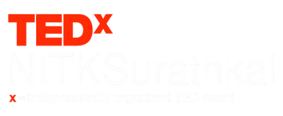

# TEDxNITKSurathkal Website
<div align="center">



<br/>

<p>
  
  
  
  
</p>

</div>

## Project Overview

This is a modern, responsive website for TEDxNITKSurathkal - an independently organized TED event at NITK Surathkal. The website showcases the event's vision of bringing innovative and inspiring "ideas worth spreading" to the local community.

## Interview Context

This project was redesigned and coded as part of an interview assignment to demonstrate:
- Modern web development skills using React and Vite
- Responsive design implementation with TailwindCSS
- Component-based architecture
- Clean, maintainable code structure

## Key Features

- **Responsive Hero Section** with animated countdown timer
- **Interactive Components** including past speakers carousel
- **Modern UI/UX** with dark theme and red accent colors
- **Performance Optimized** with Vite build system
- **Accessibility Focused** with semantic HTML and ARIA labels

## Tech Stack

- **Frontend**: React 19.1.1 with JSX
- **Build Tool**: Vite 7.1.2
- **Styling**: TailwindCSS 4.1.12
- **Icons**: Lucide React, React Icons
- **Components**: Custom UI components with shadcn/ui
- **Animations**: CSS animations and transitions

## Project Structure

```
src/
├── components/ui/          # Reusable UI components
├── modules/ui/
│   ├── components/         # Feature-specific components
│   │   ├── Counter.jsx     # Countdown timer
│   │   ├── PastSpeakers.jsx# Speaker carousel
│   │   └── Footer.jsx      # Footer component
│   └── views/
│       └── refined.jsx     # Main homepage
└── lib/                   # Utilities
```

## Quick Start

```bash
# Install dependencies
npm install

# Start development server
npm run dev

# Build for production
npm run build
```

## Design Philosophy

The website reflects TEDx's core values through:
- **Bold Typography** emphasizing key messages
- **Strategic Use of Red** (TEDx brand color) for CTAs and highlights  
- **Clean Layout** focusing on content hierarchy
- **Interactive Elements** engaging visitors
- **Tribute Section** honoring community members

## Live Features

- Real-time countdown to event date
- Interactive speaker carousel
- Newsletter subscription form
- Social media integration
- Mobile-first responsive design

---
